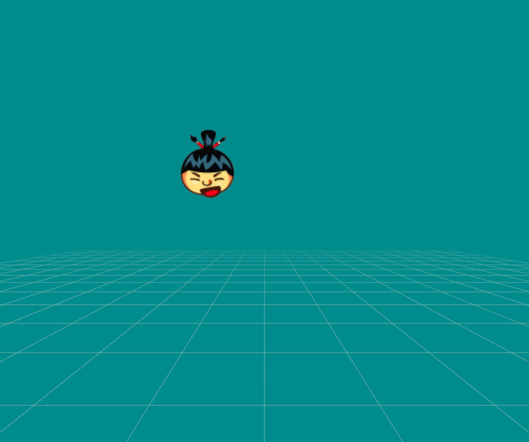
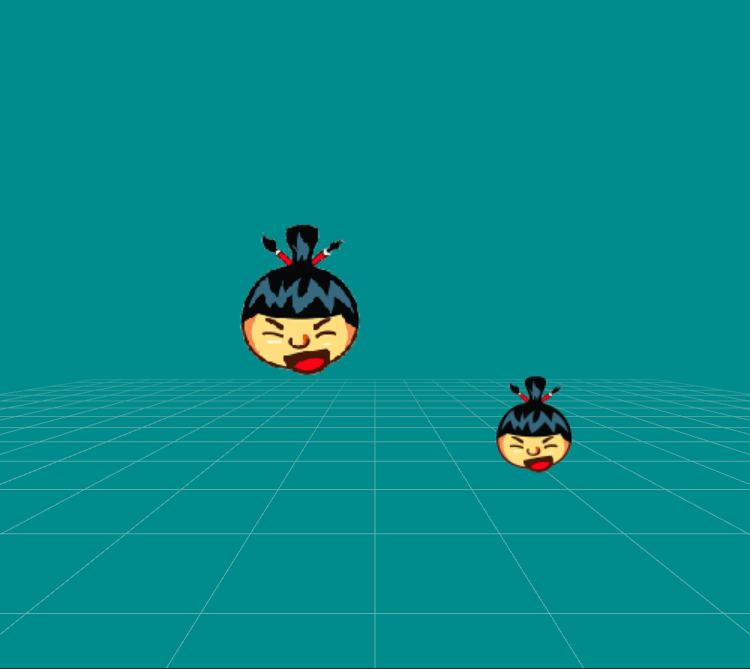

[Go back to index](index.md)

# Image

To create an Image:
```javascript
var image = new Image()
```

<details markdown="1">
  <summary>See other examples</summary>

You can give image source in constructor:

```javascript
var image = new Image('/images/icon.png')

image.position.x = 300
image.position.y = 300
image.size = { x: 100, y: 100, z: 100 }
```

You can also give an object in constructor:

```javascript
var image = new Image({ source: '/images/icon.png', position: { x: 300, y: 300 } });
```
</details>

## moveAlongCurve

`moveAlongCurve(duration, curve)` moves vector for the set duration on given [bézier curve](https://en.wikipedia.org/wiki/B%C3%A9zier_curve).

- `duration` duration of movement in milliseconds
- `curve` 4 points that represent the curve

```javascript
var image = new Image();

image.position = new Vector(200, 150);

image.moveAlongCurve(1000, {
    p0: { x: 200, y: 150 },
    p1: { x: 300, y: 450 },
    p2: { x: 50, y: 340 },
    p3: { x: 200, y: 150 }
})
```



<details markdown="1">
  <summary>See other examples</summary>

Curve can also be given as an array:
```javascript
image.moveAlongCurve(1000, [
    { x: 350, y: 350 },
    { x: 600, y: 350 },
    { x: 360, y: 350 },
    { x: 350, y: 350 }
]);
```

Curve can also be in 3D:
```javascript
image.moveAlongCurve(1000, {
    p0: { x: 350, y: 350, z: 400 },
    p1: { x: 600, y: 350, z: 400 },
    p2: { x: 360, y: 350, z: 400 },
    p3: { x: 350, y: 350, z: 400 }
})
```

Or with vectors:
```javascript
image.moveAlongCurve(1000, {
    p0: new Sumo.Vector(350, 350, 400),
    p1: new Sumo.Vector(600, 350, 400),
    p2: new Sumo.Vector(360, 350, 400),
    p3: new Sumo.Vector(350, 350, 400),
})
```
</details>

## rotateAround

`rotateAround(position, angle)` rotates image around given position for set angle in degrees.

- `position` target position [Vector](vectors.md) to rotate around
- `angle` angle in degrees to rotate

```javascript
var sumo = new Sumo.Core();

var planet = new Sumo.Image({ position: { x: 200, y: 200 }, size: { x: 100, y: 100 }})
sumo.add(planet)

var moon = new Sumo.Image({ position: { x: 75, y: 75 }});
sumo.add(moon)

var time = 0;
function moonRotate() {
    moon.rotateAround(planet.position, time * 2)
    time++;
}

Sumo.Update(moonRotate);
```

